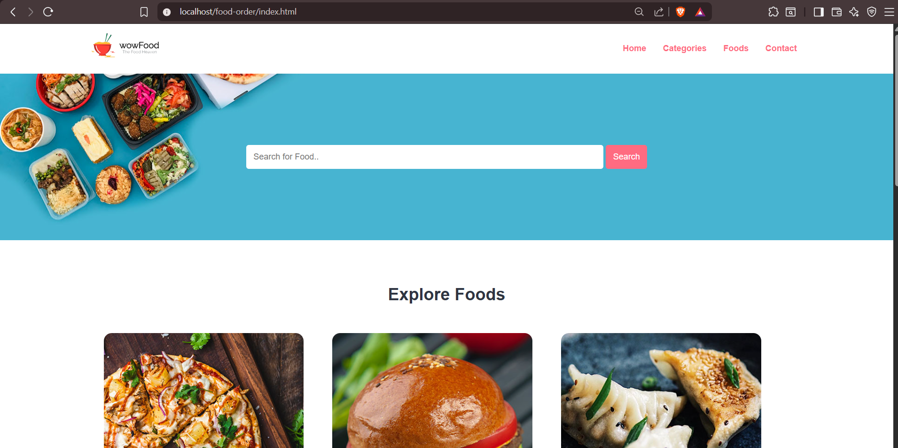
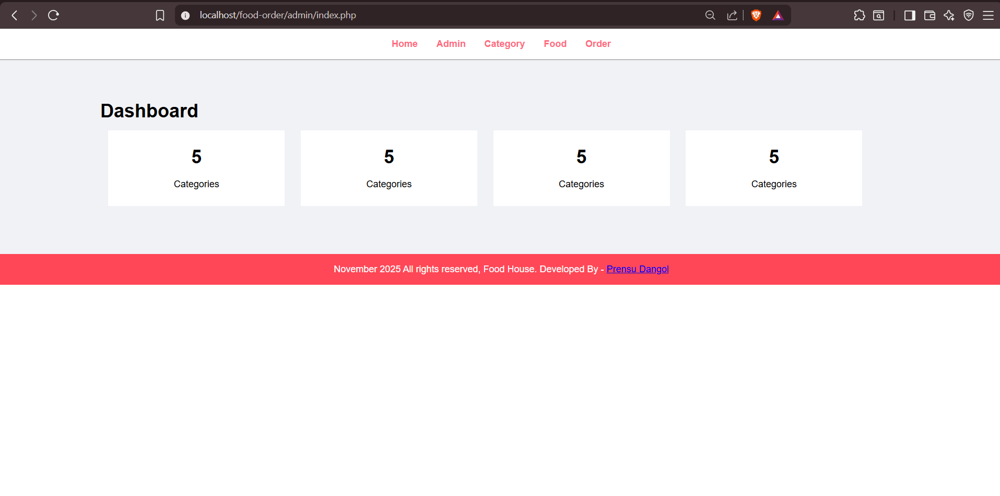
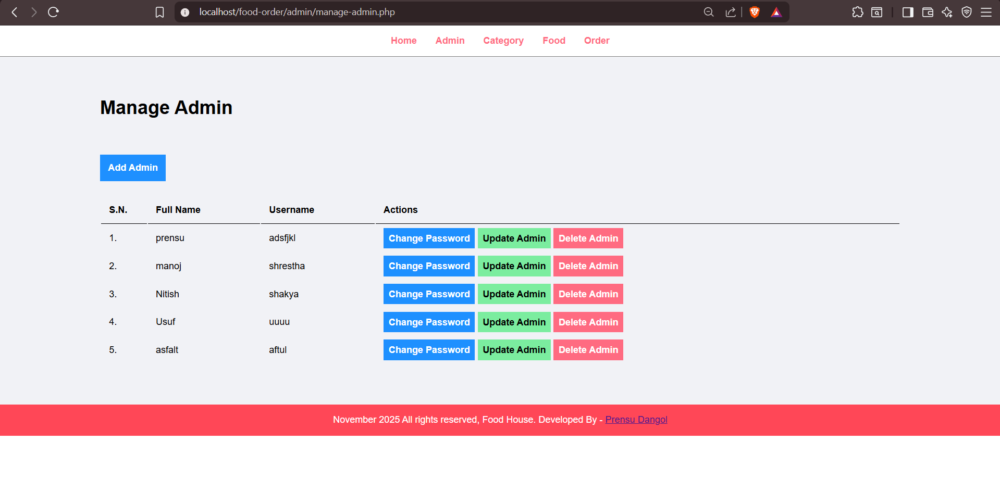
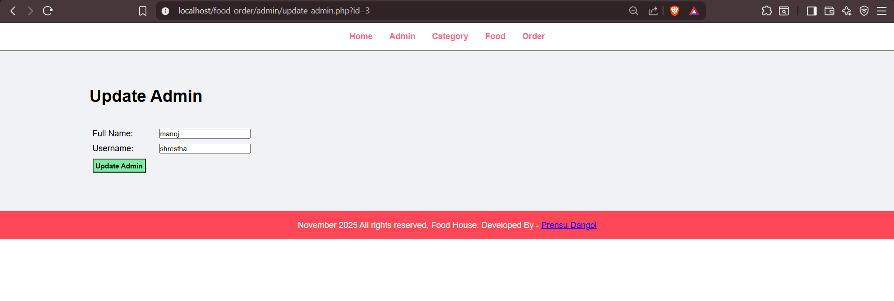

🍽️ Food Order System (PHP + MySQL)

A simple web-based Food Ordering System built using PHP, MySQL, HTML, CSS, and Bootstrap.
This project allows admins to manage food items, categories, orders, and customers through an admin dashboard.

🚀 Features
🔐 User Features

## Screenshots

### Home Page

### Admin Dashboard

Browse available food items

Search food by keywords

Order food online

View order confirmation

🛠️ Admin Features

Admin Login / Logout

Manage Admin accounts

Manage Categories

Manage Food Items (Add / Update / Delete)

Manage Orders

Update order status

View total orders, revenue, and food statistics

🧰 Technologies Used

PHP (Core PHP, no frameworks)

MySQL (XAMPP / phpMyAdmin)

HTML5 / CSS3

Bootstrap 5

Font Awesome Icons

🗂️ Database Structure

Main tables used in this project:

tbl_admin – Admin login details

tbl_category – Stores food categories

tbl_food – Stores food items

tbl_order – Stores customer orders

⚙️ How to Install and Run
1. Download or Clone the Project
git clone https://github.com/yourusername/food-order.git

2. Move project to XAMPP

Place the folder inside:

C:\xampp\htdocs\

3. Start Apache & MySQL in XAMPP
4. Create Database

Open phpMyAdmin

Create database:

food-order

Import the SQL file (if you have one)

5. Configure Database Connection

Open:

/config/constants.php

